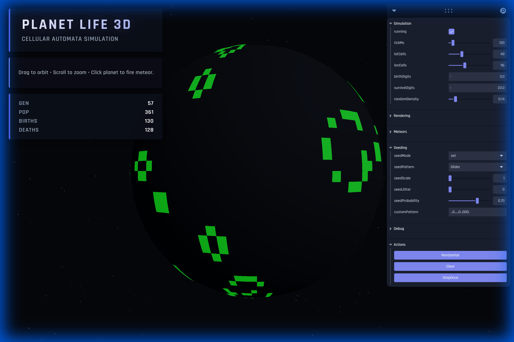

# Planet Life 3D (Conway on a Sphere)

A 3D Conway-style cellular automaton that runs on a lat/lon grid wrapped onto a planet.
Click the planet to shoot a meteor. On impact it seeds the grid using a configurable pattern.

## Features

- **CPU Simulation**: Traditional JavaScript-based cellular automata with worker support
- **GPU Simulation**: High-performance GPU-based simulation using WebGL shaders for massive grid sizes
- Multiple rendering modes (Texture, Dots, or Both)
- Custom rule sets and patterns
- Meteor impacts with visual effects
- Real-time configuration via Leva UI

## Demo Screenshot



## Run

```bash
npm install
npm run dev
```

## Controls

- Orbit with mouse (right drag to pan, wheel zoom).
- Click the planet to fire a meteor at the clicked spot.
- Tune grid/rules/speed/meteor + seeding parameters via the Leva UI.

### GPU Mode

Enable GPU simulation in the Debug panel for high-resolution grids (512x512+):

1. Open the Debug folder in Leva UI
2. Enable "gpuSim" toggle
3. Increase grid resolution (latCells/lonCells) for massive grids with no performance drop

**Note**: GPU mode uses fragment shaders for cellular automata computation with ping-pong buffer swapping. The simulation runs entirely on the GPU, updating a texture that's mapped to the planet sphere.

## GPU Implementation

The GPU simulation uses the following architecture:

- **Ping-Pong Buffers**: Two render targets swap roles each frame (read from A, write to B, then swap)
- **Fragment Shader**: Computes Game of Life rules for each pixel (cell) in parallel
- **Sphere Wrapping**: Longitude (U) wraps seamlessly, Latitude (V) clamps at poles
- **Higher Resolution**: Supports 512x1024+ grids without performance degradation

Key files:

- `src/shaders/simulation.frag.ts` - Game of Life computation shader
- `src/shaders/simulation.vert.ts` - Fullscreen quad vertex shader
- `src/components/GPUSimulation.tsx` - Buffer management and simulation loop

## Testing

- Run the test suite: `npm run test`
- Run in watch mode: `npm run test:watch`
- Open the Vitest UI: `npm run test:ui`

## Pre-commit hook (automatic formatting)

This repo uses lint-staged to automatically format and lint staged files before commit. A lightweight git hook lives in `.githooks/pre-commit` and runs `npm run format:staged` for JS/TS and other file types.

- Run `npm install` to install dependencies and configure the hook (the `postinstall` script runs `npm run install:hooks`).
- To install hooks manually, run `npm run install:hooks`.
- To format staged files manually, run `npm run format:staged`.

If you prefer not to use the hook, unset your local git hooks path with `git config --unset core.hooksPath`.

## Deployment

The site is deployed to GitHub Pages when a new tag starting with `v` is pushed (for example `v1.0.0`). The Actions workflow `\.github/workflows/deploy-pages.yml` builds the project and deploys the `dist` output using Node.js 20.x and the official GitHub Actions for Pages (`actions/configure-pages@v5`, `actions/upload-pages-artifact@v4`, `actions/deploy-pages@v4`).

To test the build locally before tagging, run:

```bash
npm install
npm run build
```
